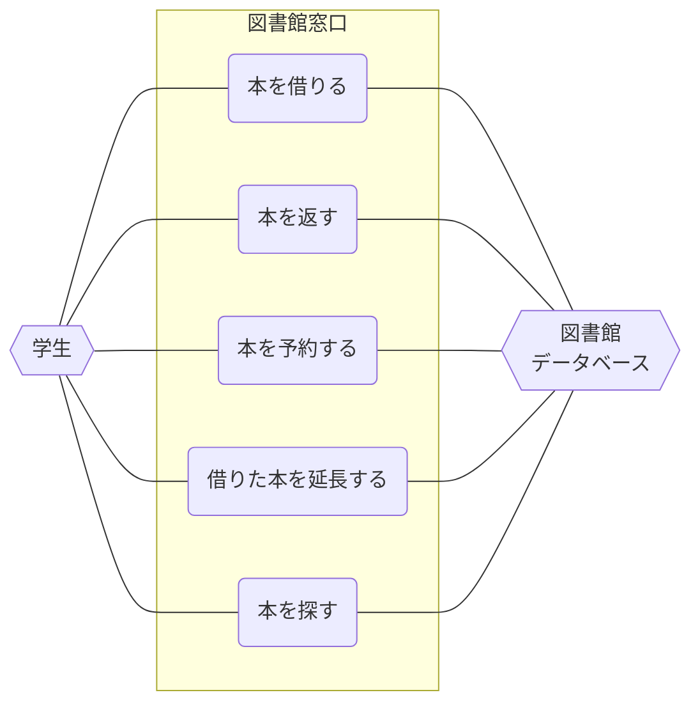

# zukagaironn-02

```mermaid
flowchart LR
a{{学生}}
b(本を借りる)
c(本を返す)
d(本を予約する)
e{{"図書館"<br>データベース}}
f(借りた本を延長する)
g(本を探す)

a --- b
a --- c
a --- d
a --- f
a --- g

b --- e
c --- e
d --- e
f --- e
g --- e


subgraph 図書館窓口
b
c
d
f
g
end

```
